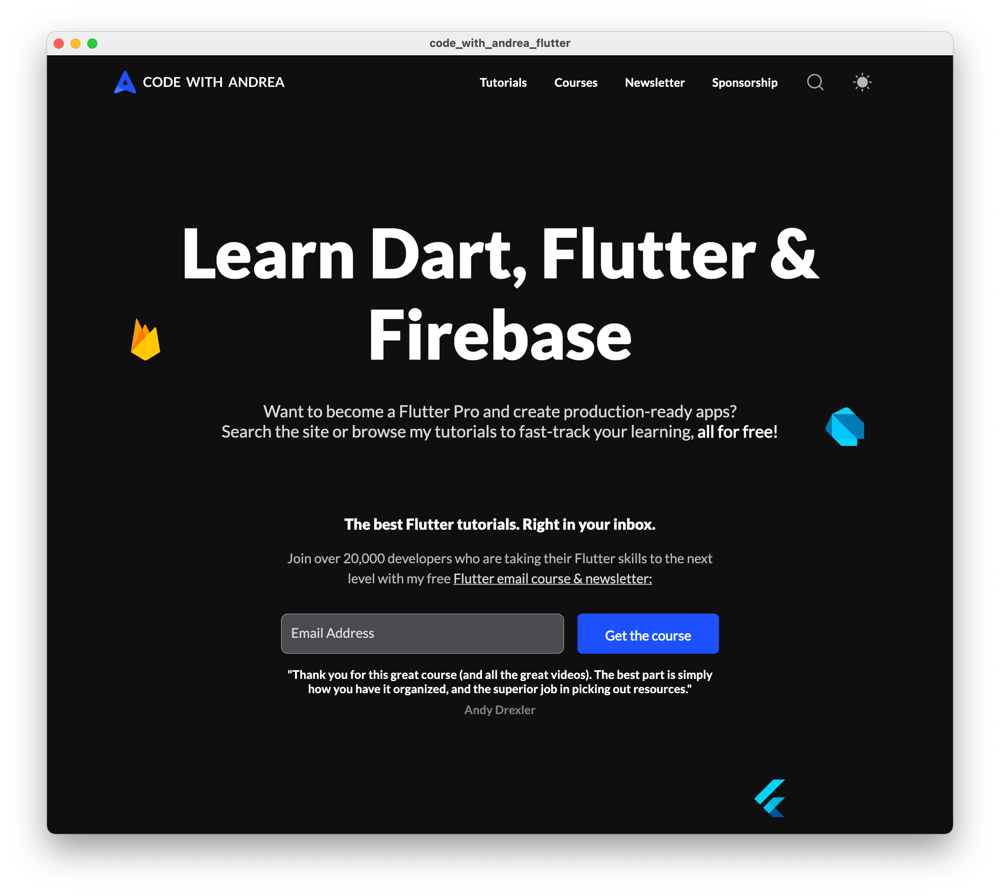

# Code With Andrea - Flutter Clone

This project is a Flutter clone of the **home page** at [codewithandrea.com](https://codewithandrea.com/).



It was built to analyze the performance of the same site built with **Flutter web** vs **HTML+CSS+JS** (see the performance comparison below). But it also runs on desktop and mobile.

A Flutter web build is hosted here:

- [Code with Andrea - Flutter web demo](https://code-with-andrea-flutter.web.app)

I've also built the same with the [`--wasm` option](https://docs.flutter.dev/platform-integration/web/wasm):

- [Code with Andrea - Flutter web wasm demo](https://code-with-andrea-flutter-wasm.web.app)

> **Note**: The Flutter web app has been tested to work on Chrome and Safari. On Firefox, WebP images don't seem to load and sometimes CanvasKit crashes with an "out of memory" exception.

## Supported Features

- Responsive navigation header on desktop, tablet, mobile
- Page intro
- Featured tutorials (cards)
- Flutter courses (cards)
- Testimonials section
- About section
- Email signup at the bottom
- Site footer

## Non-supported Features

This project is **not meant** to be a complete website, but **only a UI clone**.

As such, buttons and links don't do anything when clicked.

Furthermore, only the **dark theme** has been built (while the full site supports **light theme** also).

## Coding style

This prototype has been built in less than 10 hours. While the UI has been broken into small widget classes, this code is **not** production-ready.

## Building the app

As specified in the [Flutter web renderers](https://docs.flutter.dev/development/tools/web-renderers) page, the app can be built with three different modes:

```zsh
# default option (auto)
flutter build web --release
# html renderer
flutter build web --web-renderer html --release
# canvaskit renderer
flutter build web --web-renderer canvaskit --release
```

Additionally, wasm is also supported:

```zsh
# wasm (experimental)
flutter build web --wasm --release
```

The tests below were run with **both** the HTML and CanvasKit renderers.

## Performance report

I have deployed this clone as a Flutter web app and compared it with my main site using [PageSpeed Insights](https://pagespeed.web.dev/) and [WebPageTest.org](https://www.webpagetest.org/).

You can find all the results in this video & article on my site:

- [Flutter Web vs HTML, CSS & JS: Performance Comparison](https://codewithandrea.com/videos/flutter-web-html-css-js-performance-comparison/)

You're welcome. 😎

### [LICENSE: MIT](LICENSE.md)